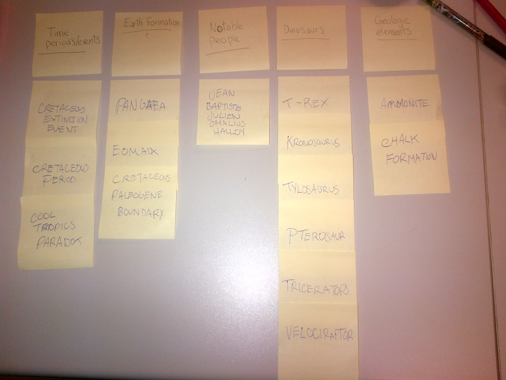
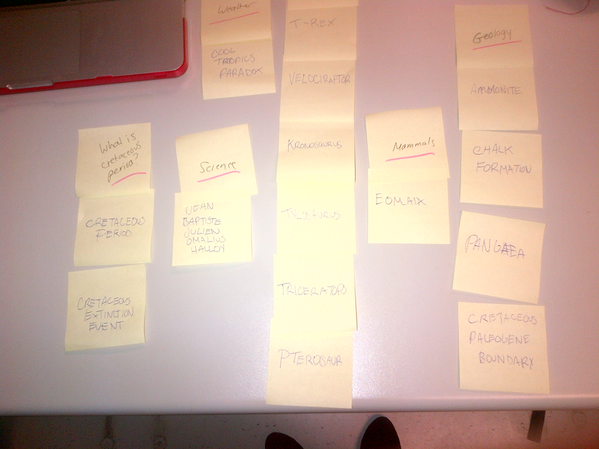

# Card sort report

The purpose of this card sort was to determine common navigation patterns and categories from the content of the Cretaceous Peroid.

## Specifics

The card sort was conducted by Laura Harvey on 2013-09-09 between the times of 10:00am and 10:20am with the following participants:

- Lianne Hebert
- Sabrina Ng

### Cards

{number} cards were used covering a broad range of applicable content for the website. The following topics were used as cards:

1. Time Period/Events
2. Dinosaurs
3. Geology
4. Notable Scientisits

## Card sort results

*Card sort 1 by Lianne Hebert*

*Card sort 2 by Sabrina Ng*

## Observations

- Did the participants have any common comments?
	- I found that the participants didnt understand some of the words,which is understandable and therefore they mgith have been placed under the wrong category.

- Did they have questions that stood out?
 	-One question about Eomaia, which actuly and early mammal, not a part of geology or a dinosaur.
 	
- Did they find common groupings? Or were the groupings completely different?
	- Some of the groupings were easy and right off the bat, like the category of Dinosaurs, some common words that they understood. But overall the groupings were very similar to each other.

- Were some of the groupings completely unexpected?

	- No.

- Were the results similar to your expectations?
	-Very similar , I feel like ther aren`t really any other options to choose from.

- How did you feel while watching them perform the task?
	- Confident in there choices and intrested.